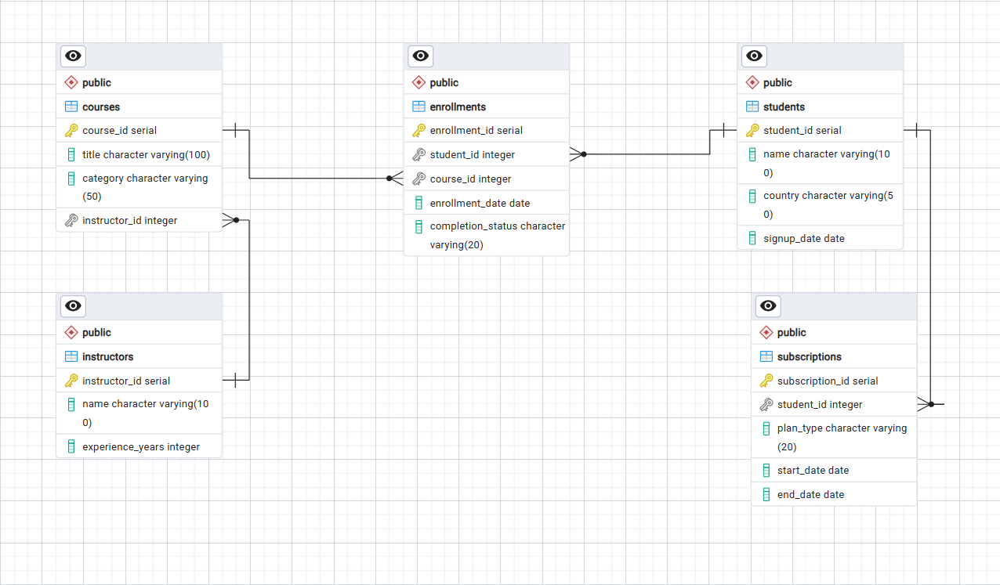
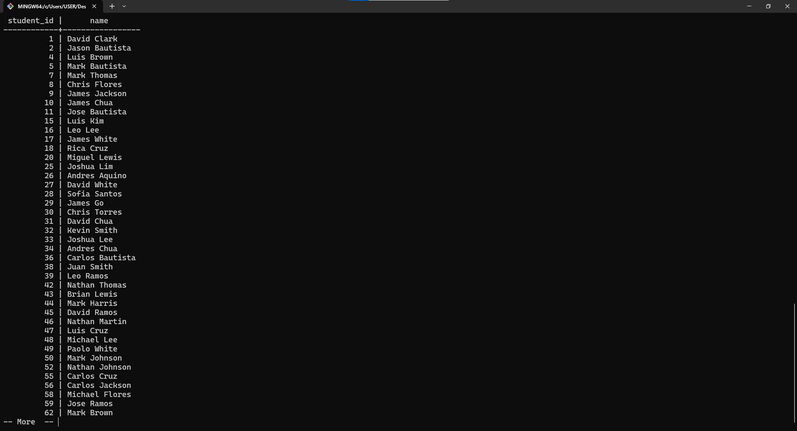
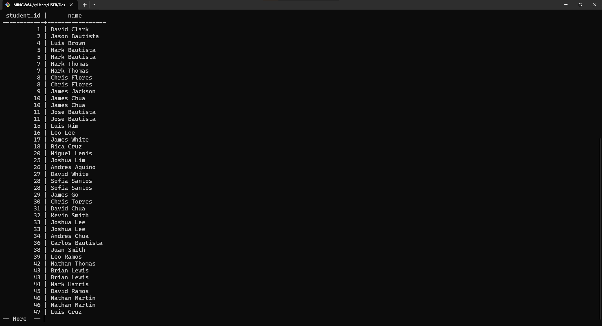
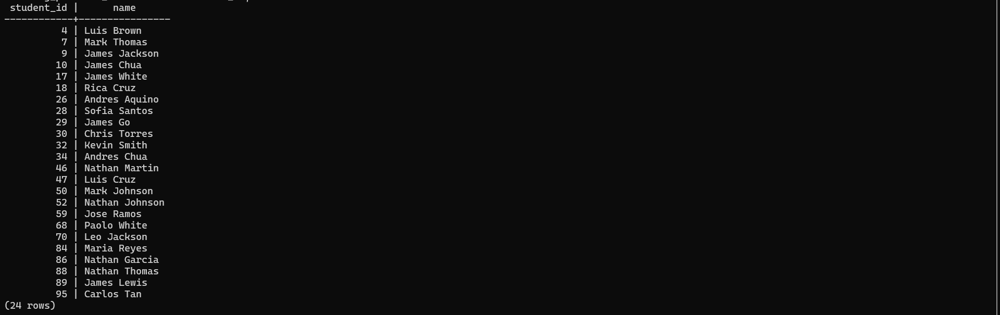
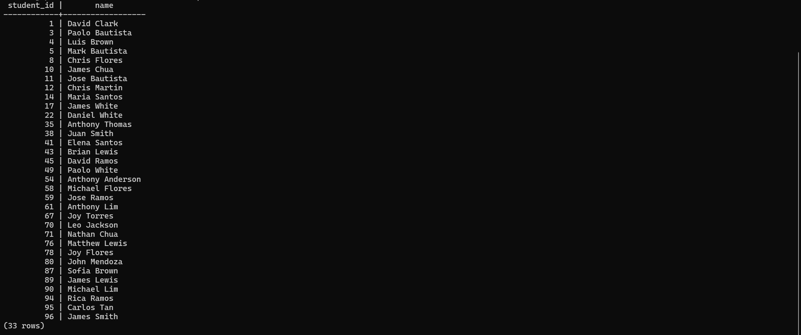
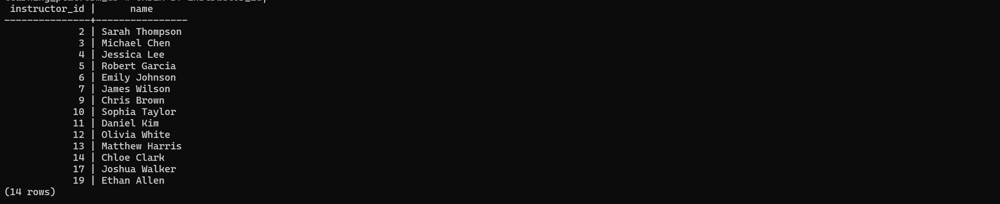
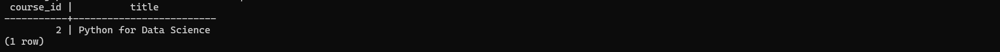
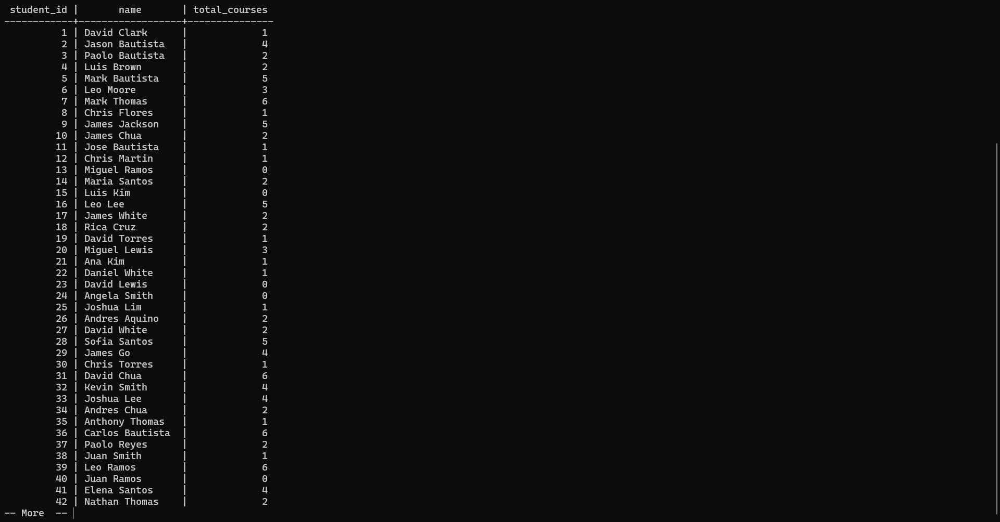
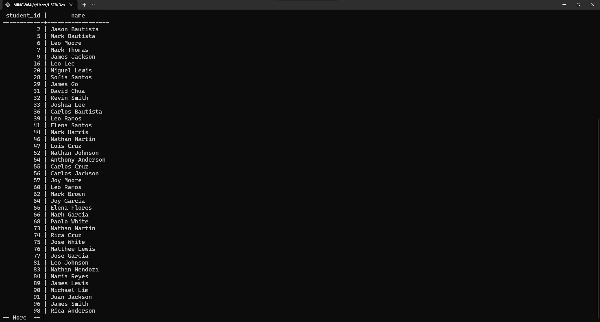
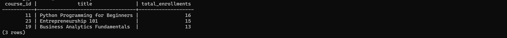

# Learning Platform SQL Project

## Overview
This project demonstrates SQL proficiency using real-world analytics scenarios
in a fictitious online learning platform.

## Objectives
- Apply Set Theory (UNION, INTERSECT, EXCEPT)
- Use Semi and Anti Joins
- Implement Subqueries in SELECT, WHERE and FROM

## Project structure
```
learning platform-sql-project/
│
├── images/
│   ├── erd.png
│   ├── q1_UNION_ALL_result.png
│   ├── q1_UNION_result.png
│   ├── q2_result.png
│   ├── q3_result.png
│   ├── q4_result.png
│   ├── q5_result.png
│   ├── q6_result.png
│   ├── q7_result.png
│   └── q8_result.png
│
├── sql/
│   ├── 01_table_creation_and_data_insertion.sql
│   ├── 02_set_operations.sql
│   ├── 03_semi_and_anti_joins.sql
│   └── 04_subqueries.sql
│
└── README.md
    
```

## Database Schema


## Questions:
1. Get a combined list of students who:
    - enrolled in a `Data Science` course
    - OR subscribed to `Premium`
2. Find students who:
    - enrolled in `Programming` courses
    - AND have `Premium` subscription
3. Find students who:
    - enrolled in at least one course
    - BUT never completed any course
4. Get instructors who have at least one completed course enrollment.
5. Find courses that no student has completed.
6. Show each student with total number of courses enrolled.
7. Find students who enrolled in more courses than the average enrollment count.
8. Find the `top 3` most enrolled courses.

## SQL scripts
- [02_set_operations.sql](./sql/02_set_operations.sql) - Demonstrates the use of SQL set operations (`UNION`, `UNION ALL`, `INTERSECT`, `EXCEPT`) to combine and compare student and course datasets, enabling insights through set-based logic.

- [03_semi_and_anti_joins.sql](./sql/03_semi_and_anti_joins.sql) - Implements semi-join and anti-join logic using subqueries to identify matching and non-matching records across related tables, such as completed course activity and inactive courses.

- [05_subqueries.sql](./sql/04_subqueries.sql) - Showcases the use of subqueries across `SELECT`, `WHERE`, and `FROM` clauses for advanced data analysis, including aggregations, filtering, and derived datasets.

**Note:** For the case of [01_table_creation_and_data_insertion.sql](./sql/01_table_creation_and_data_insertion.sql), the code was generated using `AI (ChatGPT)` for the purpose of creating the database and insertion of its data to be used for demo purposes.

## Outputs

### Question 1 result(s)

1. using `UNION`


2. using `UNION ALL`


### Question 2 result


### Question 3 result


### Question 4 result


### Question 5 result


### Question 6 result


### Question 7 result


### Question 8 result


## Tools and Technologies Used
- `PostgreSQL` and `pgAdmin` - for database interaction
- `PostgresSQL (psql) CLI` and `Git Bash` Terminal - for establishing database connection and displaying query results
- `Git` and `GitHub` - for project's version control.

## Key learnings
- Difference between `UNION` and `UNION ALL`
- Use of `INTERSECT` and `EXCEPT` in joining tables
- Subquery patterns used in analytics